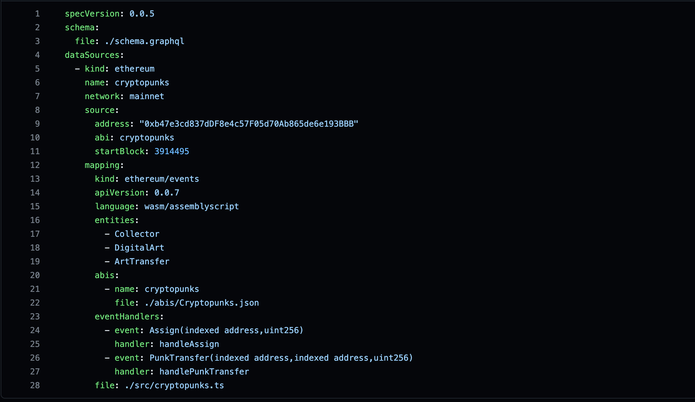
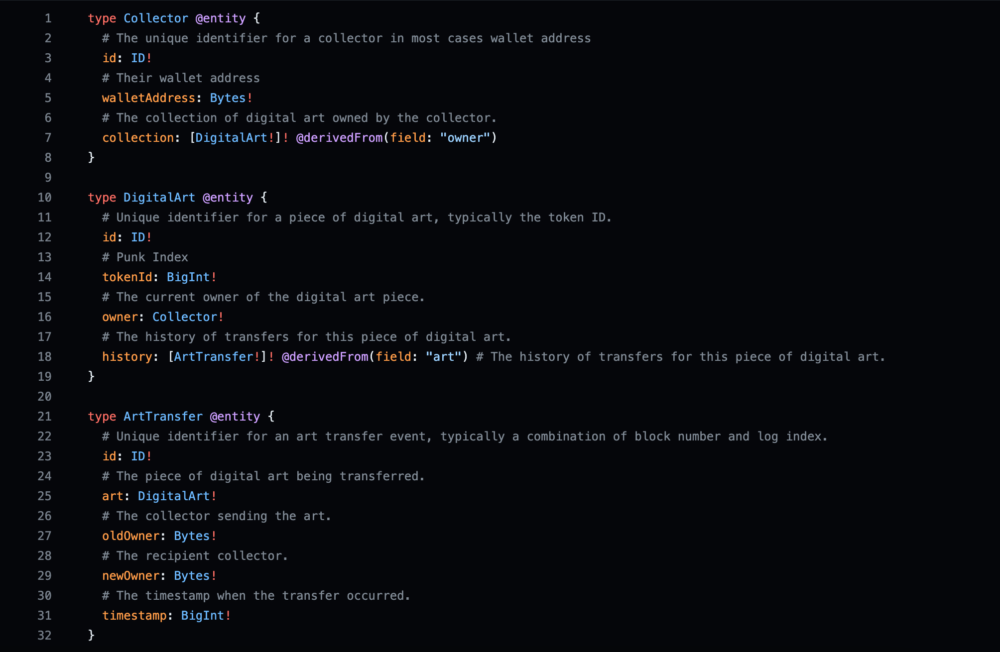

# The Graph Africa Workshop Series | Entities and Relationships

## Description

**The GraphQL Schema**

The schema for your subgraph is in the `schema.graphql` file. GraphQL schemas are defined using the GraphQL interface definition language.dd

**ENTITIES**

It is good practice to understand how your data is structured and linked. Always take time to look through **dataSources.mapping.eventHandlers** section in your `subgraph.yaml` file as this would give you a mental model on the various events' fields which you would leverage upon when defining the **entities** types within your `schema.graphql` file.

**_NOTE:_**

"_Entities should be seen as objects containing data rather than as events or functions_" - [The Graph Docs](https://thegraph.com/docs/en/developing/creating-a-subgraph/#defining-entities)

### Table of Content

- [Pre-requisities & Software Requirements](#pre-requisities--software-requirements)
- [Let's Build 🚀](#lets-build-🚀)
  - [A bit about CryptoPunks](#a-bit-about-cryptopunks)
  - [subgraph.yaml](#subgraphyaml)
  - [schema.graphql](#schemagraphql)
  - [Handler functions `./src/cryptopunks.ts`](#handler-functions-srccryptopunksts)
- [TASK](#task)

## Pre-requisities & Software Requirements

### Prerequisities

To follow adequately this workshop, the following are required:

- <input type="checkbox" checked /> Good Knowledge of initializing, developing, and deploying a subgraph.

- <input type="checkbox" checked /> How events work in Solidity & Smart Contracts.

- <input type="checkbox" checked /> How functions work in any programming language preferrably **Assembly Script**

### Software Requirments

- A code editor - [**VSCode**](https://code.visualstudio.com/download)
- [**NodeJS**](https://nodejs.org/en/download) installed
- The [**Graph CLI**](https://thegraph.com/studio/?show=Create) installed

## Let's Build 🚀

The contract we would be working with is the CryptoPunk NFT smart contract.

### A bit about CryptoPunks

"_The CryptoPunks are 10,000 uniquely generated characters. No two are exactly alike, and each one of them can be officially owned by a single person on the Ethereum blockchain_". - [CryptoPunks Official Website](https://www.larvalabs.com/cryptopunks)

**ETHEREUM CONTRACT ADDRESS**

`0xb47e3cd837dDF8e4c57F05d70Ab865de6e193BBB`

### subgraph.yaml

A look at the **subgraph.yaml** file, within the `dataSources.mapping` section, we see the **entities** (objects containing data) we'd be developing.

The **eventHandlers** is simply an array of events (defined in the smart contract) and their respective [function handlers](./src/cryptopunks.ts)

<div align="left">
    
</div>

### schema.graphql

**_Note :_** the entities stated in the `dataSources.mapping.entities` section in the `subgraph.yaml` file have their type definition in this file - `schema.graphql`

#### A bit on ENTITY RELATIONSHIP

An entity may have a relationship to one or more entities in your schema.

In our example, the DigitalArt entity has a **ONE-TO-ONE** relationship with the `Collector` entity using the `owner` field as shown below:

```graphql
type DigitalArt @entity {
  # Unique identifier for a piece of digital art, typically the token ID.
  id: ID!
  # Punk Index
  tokenId: BigInt!
  # The current owner of the digital art piece.
  owner: Collector!
  # The history of transfers for this piece of digital art.
  history: [ArtTransfer!]! @derivedFrom(field: "art") # The history of transfers for this piece of digital art.
}
```

The relationship can be unidirectional as shown above or bidirectional.

Take a moment to check if the code-block above has any other field that exhibits a relationship with some other entity?

**...**

YES! The `history` field has a **ONE-TO-MANY** relationship with `ArtTransfer` entity.

A **ONE-TO-MANY** relationship is a field pointing to an array of an entity.

"_An array is a data structure that stores a collection of elements. These elements are usually of the same type_"

#### CHECKPOINT ✋

A **ONE-TO-ONE** Relationship: `owner: Collector!`

A **ONE-TO-MANY** Relationship: `history: [ArtTransfer!]! @derivedFrom(field: "art")`

<div align="left">
    
    <p>Entity definitions in <b>schema.graphql</b> file</p>
</div>

### Handler functions ./src/cryptopunks.ts

Diving into the `cryptopunks.ts` file in the `src` directory, we can populate our entities within the handleX function blocks.

At the top, we import the auto-generated event types that the Graph `graph codegen` command provides us with. We also have some generic types imports from "**@graphprotocol/graph-ts\***" module like - _BigInt_ (for `uint256`), _Bytes_ (for `address`)

#### Populating fields in an Entity - `Collector`

For the `Collector` entity, the fields include:

- `id`
- `walletAddress`
- and `collection`

Within the `handleAssign` function, we accept an event param (typed to **Assign**) which holds the event data (indexed fields, transaction details), we can use this data to populate our `Collector` entity. We perform a check to see if an `id` exists by passing the `to` Assign event field into the `Collector.load` function.

If this collector with this address as `id` field exists, we skip else, we instantiate the `Collector` entity by passing the id as `new Collector(event.params.to.toHexString())`. This returns a new `Collector` entity class which we can set the `walletAddress` using the `event.params.to` address value and saving the new collector to be indexed by the Graph.

<details>

<summary>Code</summary>

```js
export function handleAssign(event: Assign): void {
  // Convert the 'to' address from the event to a hex string to use as the collector's ID.
  let collectorId = event.params.to.toHexString();

  // Attempt to load an existing collector from the subgraph by ID. If none exists, `null` is returned.
  let collector = Collector.load(collectorId);

  // If the collector does not already exist, create a new one with the given ID.
  if (!collector) {
    collector = new Collector(collectorId); // Instantiate a new Collector entity with the collectorId.
    collector.walletAddress = event.params.to; // Set the wallet address of the collector to the 'to' parameter from the event.
    collector.save(); // Save the new collector entity to the subgraph.
  }
  ...
}
```

</details>

Feel free to PERUSE through the codebase and notice how we populate our various entities using various events that contain the data we need.

## TASK

This is where you flex those big muscles of yours and show off what you've learnt 💪💪 in this workshop!

1. Notice how there are no entities that track the amount of `ETH` used to purchase a **DigitalArt**. Create an entity in the `schema.graphql`, define the entity and handler in your `subgraph.yaml` file and develop the appropriate code to populate your own defined entity within the event handler in the `./src/cryptopunks.ts` file.

2. Develop a different subgraph and create custom entities that use the event data creatively to make your subgraph efficiently serve rich blockchain data 😎

3. Prepare a README for this repository...

##

#### HAPPY Hacking 🚀🚀
